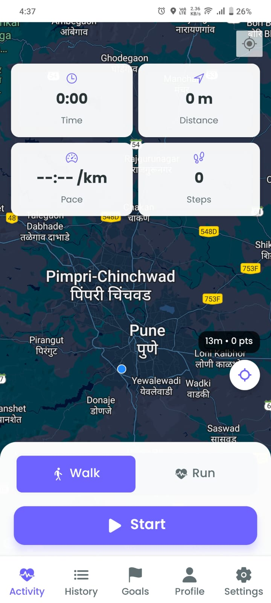
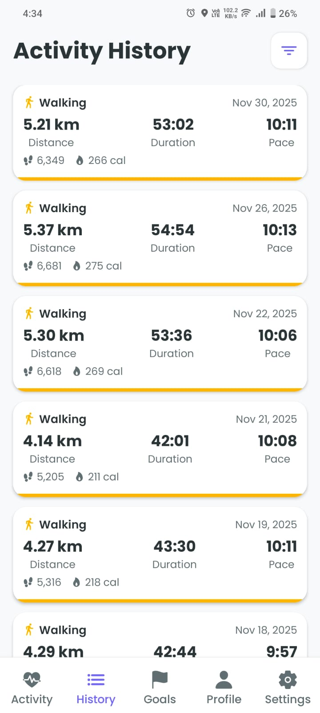
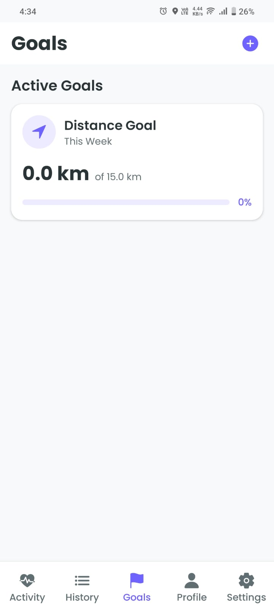
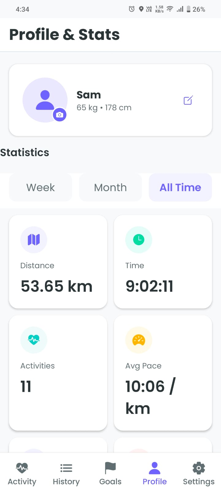
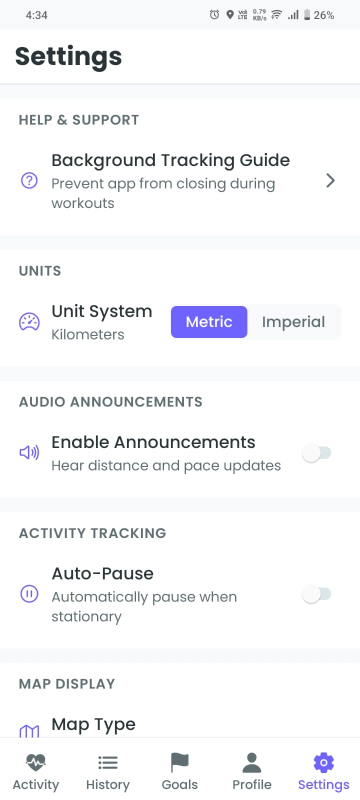

# FitTracker

A comprehensive fitness tracking solution consisting of a React Native mobile app and a Next.js landing page.

## Projects

### 📱 Fitness Tracker App (`/fitness-tracker-app`)
A React Native mobile application built with Expo for tracking walking and running activities.

### 🌐 Landing Page (`/fitness-landing`)
A Next.js marketing website for the FitTracker app.

---

## Fitness Tracker App

### Screenshots

<p align="center">
  
  
  
  
  
</p>

### Features

- **Real-time Activity Tracking** - Track walking and running with live metrics
- **GPS Route Mapping** - High-accuracy location tracking with route visualization
- **Statistics & Analytics** - View progress with charts and detailed stats
- **Goal Setting** - Set daily/weekly goals and track achievements
- **Background Tracking** - Continue tracking even when app is minimized
- **Local Storage** - All data stored on device for privacy
- **Data Export** - Export your activity data for backups
- **Personal Records** - Track your best performances

### Tech Stack

| Technology | Purpose |
|------------|---------|
| React Native | Cross-platform mobile framework |
| Expo | Development platform & build tools |
| TypeScript | Type-safe JavaScript |
| React Navigation | Screen navigation |
| React Native Maps | Route visualization |
| AsyncStorage | Local data persistence |
| Expo Location | GPS tracking |
| Expo Sensors | Step counting |

### Permissions Required

#### Android
| Permission | Purpose |
|------------|---------|
| `ACCESS_FINE_LOCATION` | Precise GPS tracking |
| `ACCESS_COARSE_LOCATION` | Approximate location |
| `ACCESS_BACKGROUND_LOCATION` | Track while app is minimized |
| `ACTIVITY_RECOGNITION` | Step counting & activity detection |
| `FOREGROUND_SERVICE` | Background tracking service |
| `FOREGROUND_SERVICE_LOCATION` | Location updates in background |

#### iOS
| Permission | Purpose |
|------------|---------|
| Location When In Use | GPS tracking while using app |
| Location Always | Background location tracking |
| Motion & Fitness | Step counting via pedometer |

### Getting Started

```bash
# Navigate to app directory
cd fitness-tracker-app

# Install dependencies
npm install

# Start development server
npm start

# Run on Android
npm run android

# Run on iOS (Mac only)
npm run ios
```

### Building for Production

#### Android APK/AAB
```bash
cd fitness-tracker-app/android

# Debug APK
./gradlew assembleDebug

# Release APK (smaller, optimized)
./gradlew assembleRelease

# App Bundle for Play Store
./gradlew bundleRelease
```

#### Build Optimizations
- ProGuard/R8 minification enabled
- Resource shrinking enabled
- PNG crunching enabled
- Hermes JS engine for better performance

---

## Landing Page

### Tech Stack
- Next.js 14
- TypeScript
- Tailwind CSS

### Getting Started

```bash
cd fitness-landing
npm install
npm run dev
```

---

## Project Structure

```
/
├── fitness-tracker-app/     # React Native mobile app
│   ├── src/                 # Source code
│   │   ├── components/      # UI components
│   │   ├── screens/         # App screens
│   │   ├── services/        # Business logic
│   │   ├── hooks/           # Custom hooks
│   │   ├── context/         # State management
│   │   └── types/           # TypeScript types
│   ├── android/             # Android native code
│   ├── assets/              # Images & fonts
│   └── app.json             # Expo config
│
├── fitness-landing/         # Next.js landing page
│   ├── app/                 # App router pages
│   ├── public/              # Static assets
│   └── tailwind.config.ts   # Tailwind config
│
└── README.md                # This file
```

## License

MIT
