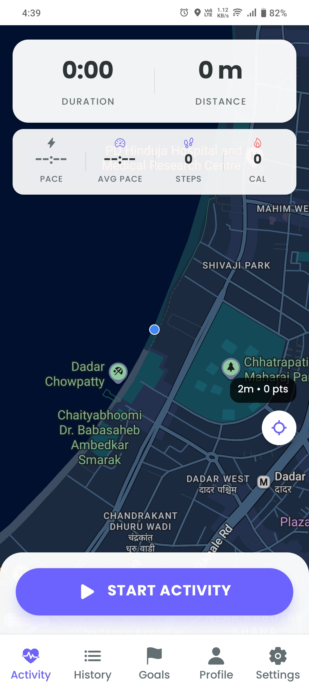
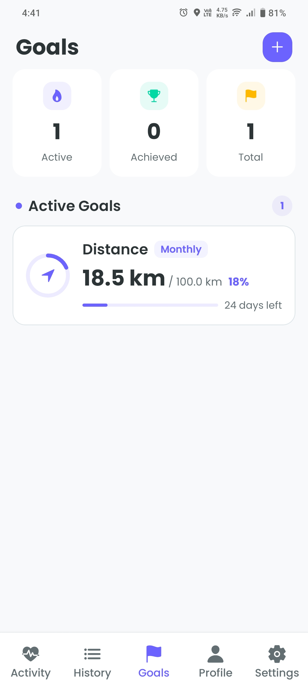
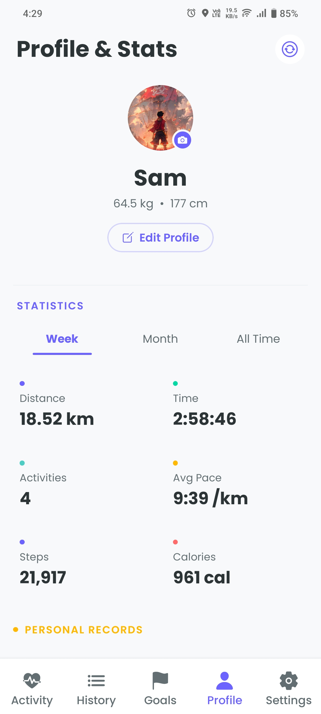
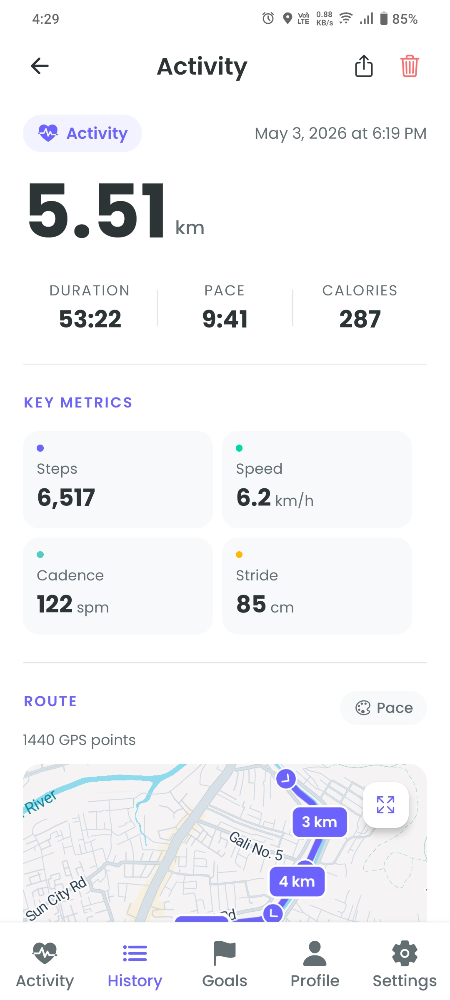

# Stride

Stride is a modern, intuitive fitness tracking solution designed to help you monitor your walking and running activities seamlessly. It consists of a React Native mobile app and a Next.js landing page.

## Projects

### 📱 Stride Mobile App (`/fitness-tracker-app`)
A feature-rich React Native mobile application built with Expo for tracking walking and running activities with real-time metrics and route mapping.

### 🌐 Landing Page (`/fitness-landing`)
A Next.js marketing website showcasing the Stride app.

---

## Stride Mobile App

### 📸 Screenshots

<table>
  <tr>
    <td align="center">
      
      <br />
      <b>🔐 Login</b>
      <br />
      <sub>Secure Google OAuth authentication</sub>
    </td>
    <td align="center">
      
      <br />
      <b>🏃 Activity Tracking</b>
      <br />
      <sub>Real-time stats: distance, pace, calories</sub>
    </td>
    <td align="center">
      
      <br />
      <b>📋 History</b>
      <br />
      <sub>Browse past activities & route maps</sub>
    </td>
  </tr>
  <tr>
    <td align="center">
      
      <br />
      <b>🎯 Goals</b>
      <br />
      <sub>Set & track daily/weekly targets</sub>
    </td>
    <td align="center">
      
      <br />
      <b>👤 Profile</b>
      <br />
      <sub>View stats & activity streaks</sub>
    </td>
    <td align="center">
      
      <br />
      <b>📈 Activity Details</b>
      <br />
      <sub>In-depth metrics for each session</sub>
    </td>
  </tr>
  <tr>
    <td align="center">
      
      <br />
      <b>⚙️ Settings</b>
      <br />
      <sub>Customize preferences & export data</sub>
    </td>
    <td></td>
    <td></td>
  </tr>
</table>

### Key Features

- **Real-time Activity Tracking** - Track walking and running with live metrics (distance, pace, calories burned, and time)
- **GPS Route Mapping** - High-accuracy location tracking with beautiful route visualization on interactive maps
- **Statistics & Analytics** - View your progress with comprehensive charts, detailed stats, and historical data
- **Goal Setting** - Set daily and weekly targets, monitor streaks, and track achievements
- **Background Tracking** - Continue tracking your activities seamlessly even when the app is minimized or the screen is locked
- **Local Storage** - All data is securely stored on your device for enhanced privacy
- **Data Export** - Export your activity data for personal backups or external analysis
- **Personal Records** - Automatically track and celebrate your best performances and milestones
- **Extended Authentication** - Secure Google OAuth with long-lived 1-year sessions for a frictionless experience

### Tech Stack

| Technology | Purpose |
|------------|---------|
| React Native | Cross-platform mobile framework |
| Expo | Development platform & build tools |
| TypeScript | Type-safe JavaScript |
| React Navigation | Screen navigation |
| React Native Maps | Route visualization |
| Supabase | Backend & Authentication |
| AsyncStorage | Local data persistence |
| Expo Location | GPS tracking |
| Expo Sensors | Step counting |

### Permissions Required

#### Android
| Permission | Purpose |
|------------|---------|
| `ACCESS_FINE_LOCATION` | Precise GPS tracking |
| `ACCESS_COARSE_LOCATION` | Approximate location |
| `ACCESS_BACKGROUND_LOCATION` | Track while app is minimized |
| `ACTIVITY_RECOGNITION` | Step counting & activity detection |
| `FOREGROUND_SERVICE` | Background tracking service |
| `FOREGROUND_SERVICE_LOCATION` | Location updates in background |

#### iOS
| Permission | Purpose |
|------------|---------|
| Location When In Use | GPS tracking while using app |
| Location Always | Background location tracking |
| Motion & Fitness | Step counting via pedometer |

### Getting Started

```bash
# Navigate to app directory
cd fitness-tracker-app

# Install dependencies
npm install

# Start development server
npm start

# Run on Android
npm run android

# Run on iOS (Mac only)
npm run ios
```

### Building for Production

#### Android APK/AAB
```bash
cd fitness-tracker-app/android

# Debug APK
./gradlew assembleDebug

# Release APK (smaller, optimized)
./gradlew assembleRelease

# App Bundle for Play Store
./gradlew bundleRelease
```

#### Build Optimizations
- ProGuard/R8 minification enabled
- Resource shrinking enabled
- PNG crunching enabled
- Hermes JS engine for better performance

---

## Landing Page

### Tech Stack
- Next.js 14
- TypeScript
- Tailwind CSS

### Getting Started

```bash
cd fitness-landing
npm install
npm run dev
```

---

## Project Structure

```
/
├── fitness-tracker-app/     # React Native mobile app
│   ├── src/                 # Source code
│   │   ├── components/      # UI components
│   │   ├── screens/         # App screens
│   │   ├── services/        # Business logic
│   │   ├── hooks/           # Custom hooks
│   │   ├── context/         # State management
│   │   └── types/           # TypeScript types
│   ├── android/             # Android native code
│   ├── assets/              # Images & fonts
│   └── app.json             # Expo config
│
├── fitness-landing/         # Next.js landing page
│   ├── app/                 # App router pages
│   ├── public/              # Static assets
│   └── tailwind.config.ts   # Tailwind config
│
└── README.md                # This file
```

## License

MIT
